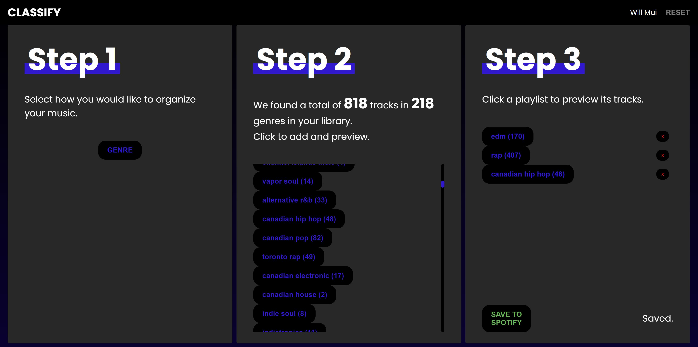

# Classify
Classify is a web based app which helps Spotify users organize their Liked Songs by genre. The three step process involves fetching the user's library, sorting all tracks by their respective genre, and finally previewing and saving these playlists to Spotify.

Classify is deployed on Heroku and can be found [here.](https://classify-spotify-app.herokuapp.com)

As a MERN stack application, Classify uses a React.js frontend, a Node.js + Express.js backend server, and a MongoDB database running on AWS. The app leverages the Spotify Web API, using the spotify-web-api-node wrapper library to perform OAuth2 authentication, as well as any calls to the resource server. Since multiple requests are required per user for fetching their Liked Songs and saving their playlists, the access tokens are encrypted and persisted for a limited time on a remote MongoDB database using the express-session middleware.
